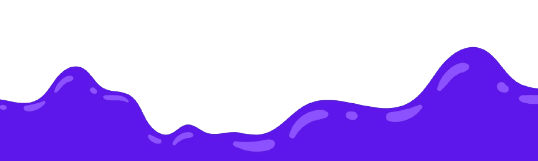

This is Suraj Gore! Welcome to my GitHub profile! Here's a bit about me:  About Me  - 🌱 I’m currently learning: Flutter App Development. - 👯 I’m looking to collaborate on: App devepoment  projects along with AI integration for backend. - 🤔 I’m looking for help with: Backend and integrating Ai in apps. - 💬 Ask me about: My projects from github.

###

  
  

###

  
  
  
  
  
  
  
  
  
  
  
  
  

###

  
  

###

###
<picture>
  <source media="(prefers-color-scheme: dark)" srcset="https://raw.githubusercontent.com/tobiasmeyhoefer/tobiasmeyhoefer/output/github-snake-dark.svg" />
  <source media="(prefers-color-scheme: light)" srcset="https://raw.githubusercontent.com/tobiasmeyhoefer/tobiasmeyhoefer/output/github-snake.svg" />
  
</picture>
